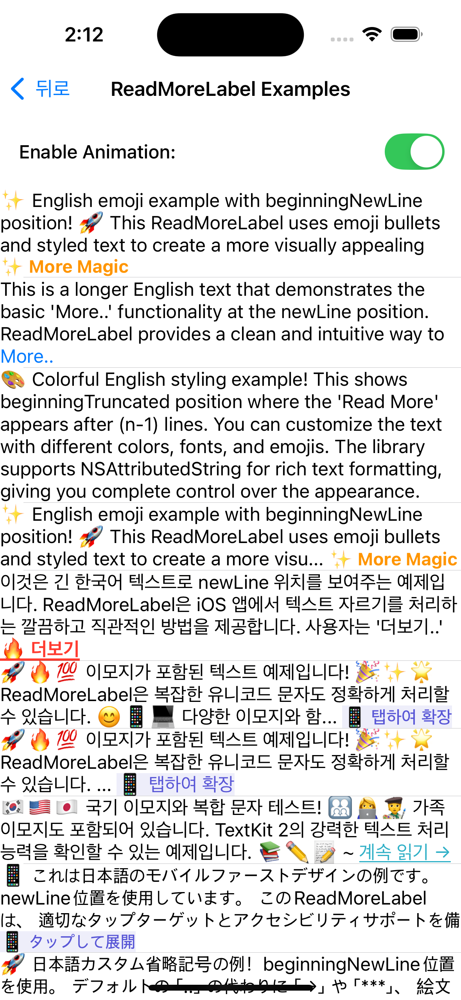
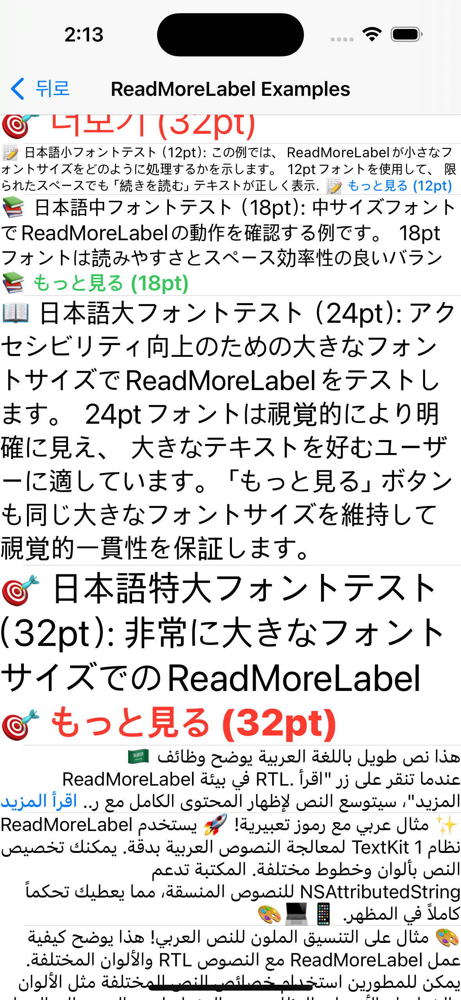
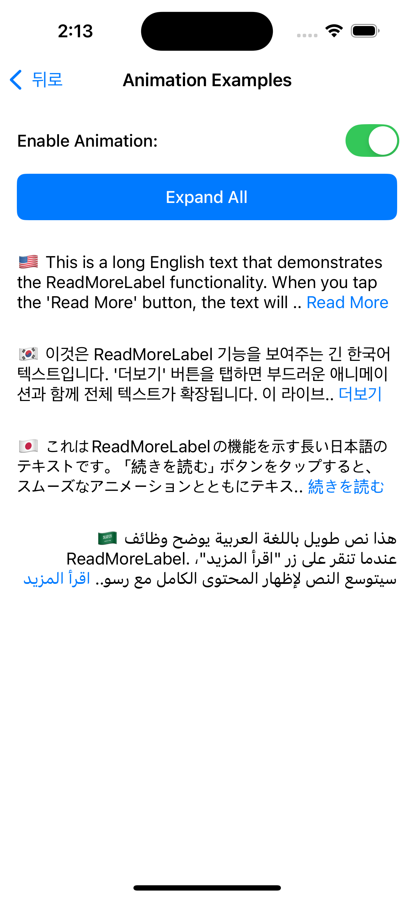
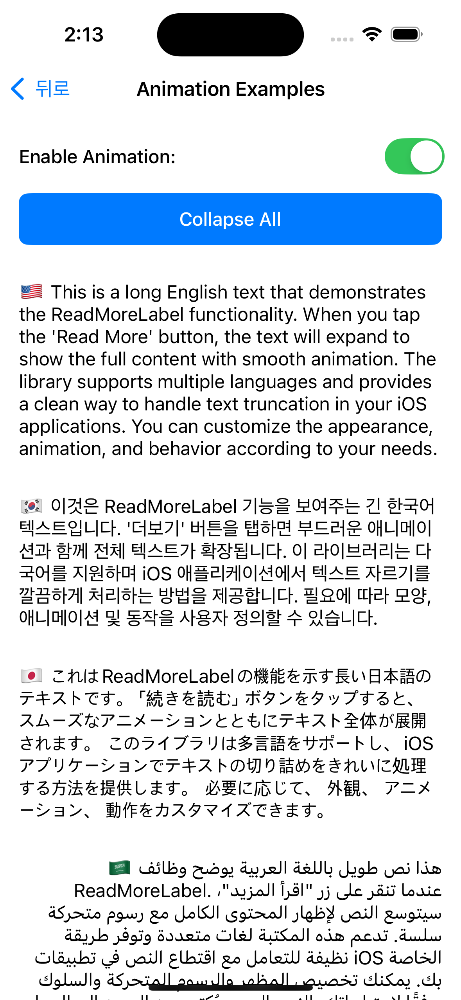

# ReadMoreLabel

[](https://swift.org)
[](https://developer.apple.com/ios/)
[](LICENSE)

فئة فرعية قوية ومرنة من UILabel توفر وظيفة "اقرأ المزيد" مع إمكانيات أنيقة لقطع النص وتوسيعه.

[한국어](README-ko.md) | [日本語](README-ja.md) | [English](README.md) | **العربية**

## 🎬 العرض التوضيحي


## 📱 لقطات الشاشة

### أمثلة الرسوم المتحركة
 

### أمثلة العرض الجدولي
 

## ✨ المميزات

- **قطع ذكي للنص**: يحسب بدقة تخطيط النص لإظهار "اقرأ المزيد" في الموضع المحدد
- **تدفق طبيعي للنص**: نص ellipsis قابل للتخصيص قبل "اقرأ المزيد" للاتصال البصري السلس (`النص.. اقرأ المزيد..`)
- **تحديد موضع مرن**: اختر ما إذا كان "اقرأ المزيد" يظهر في نهاية أو بداية المحتوى المقطوع
- **دقة على مستوى الحروف**: يضبط بدقة موضع القطع على مستوى الكلمات والحروف للاستفادة المثلى من المساحة
- **دعم اللغات من اليمين إلى اليسار**: دعم كامل للغات من اليمين إلى اليسار (العربية، العبرية) مع معالجة صحيحة للنص ثنائي الاتجاه
- **رسوم متحركة سلسة**: رسوم متحركة مدمجة للتوسيع/الطي مع استدعاءات الوكيل
- **مظهر قابل للتخصيص**: دعم تصميم NSAttributedString على نص "اقرأ المزيد"
- **تكوين مرن**: تعطيل وظيفة "اقرأ المزيد" عبر تعيين `numberOfLinesWhenCollapsed = 0`
- **توافق UILabel**: استبدال مباشر مع الحد الأدنى من تغييرات الكود
- **دعم Interface Builder**: IBDesignable مع خصائص IBInspectable
- **تصميم API آمن**: يمنع التعديل المباشر لخصائص UILabel الموروثة

## 🚀 التثبيت

### Swift Package Manager

```swift
dependencies: [
    .package(url: "https://github.com/baccusf/ReadMoreLabel.git", from: "0.1.0")
]
```

### CocoaPods

```ruby
pod 'ReadMoreLabel', '~> 0.1.0'
```

### التثبيت اليدوي

1. قم بتنزيل المستودع
2. اسحب `ReadMoreLabel.swift` إلى مشروع Xcode الخاص بك

## 📖 الاستخدام

### التنفيذ الأساسي

```swift
import ReadMoreLabel

class ViewController: UIViewController {
    @IBOutlet weak var readMoreLabel: ReadMoreLabel!
    
    override func viewDidLoad() {
        super.viewDidLoad()
        
        // التكوين الأساسي
        readMoreLabel.numberOfLinesWhenCollapsed = 3
        readMoreLabel.text = "محتوى النص الطويل الخاص بك هنا..."
        
        // نص "اقرأ المزيد" المخصص مع التصميم
        let attributes: [NSAttributedString.Key: Any] = [
            .foregroundColor: UIColor.systemBlue,
            .font: UIFont.systemFont(ofSize: 16, weight: .medium)
        ]
        readMoreLabel.readMoreText = NSAttributedString(string: "اقرأ المزيد..", attributes: attributes)
        
        // تخصيص نص ellipsis والموضع
        readMoreLabel.ellipsisText = NSAttributedString(string: "←")  // ellipsis مخصص
        readMoreLabel.readMorePosition = .end  // الموضع في النهاية (افتراضي)
        
        // تعيين الوكيل لأحداث التوسيع
        readMoreLabel.delegate = self
    }
}

extension ViewController: ReadMoreLabelDelegate {
    func readMoreLabel(_ label: ReadMoreLabel, didChangeExpandedState isExpanded: Bool) {
        print("تم توسيع التسمية: \(isExpanded)")
        
        // اختياري: تحريك تغييرات التخطيط
        UIView.animate(withDuration: 0.3) {
            self.view.layoutIfNeeded()
        }
    }
}
```

### الاستخدام البرمجي

```swift
let readMoreLabel = ReadMoreLabel()
readMoreLabel.numberOfLinesWhenCollapsed = 2
readMoreLabel.text = "محتوى النص الطويل..."
readMoreLabel.translatesAutoresizingMaskIntoConstraints = false

view.addSubview(readMoreLabel)
NSLayoutConstraint.activate([
    readMoreLabel.topAnchor.constraint(equalTo: view.safeAreaLayoutGuide.topAnchor, constant: 20),
    readMoreLabel.leadingAnchor.constraint(equalTo: view.leadingAnchor, constant: 16),
    readMoreLabel.trailingAnchor.constraint(equalTo: view.trailingAnchor, constant: -16)
])
```

### التحكم اليدوي

```swift
// توسيع/طي برمجياً
readMoreLabel.expand()
readMoreLabel.collapse()

// تعيين حالة التوسيع برمجياً
readMoreLabel.setExpanded(true)

// فحص الحالة الحالية
if readMoreLabel.isExpanded {
    print("موسع حالياً")
}

// فحص إذا كان النص قابل للتوسيع
if readMoreLabel.isExpandable {
    print("النص مقطوع ويمكن توسيعه")
}
```

### تعطيل وظيفة "اقرأ المزيد"

```swift
// تعيين إلى 0 لتعطيل القطع (يعمل مثل UILabel عادي)
readMoreLabel.numberOfLinesWhenCollapsed = 0
```

## 🎨 التخصيص

### الخصائص

| الخاصية | النوع | الوصف | الافتراضي |
|----------|------|-------------|---------|
| `numberOfLinesWhenCollapsed` | `Int` | عدد الأسطر المراد إظهارها عند الطي (0 = غير محدود) | `3` |
| `readMoreText` | `NSAttributedString` | نص "اقرأ المزيد" قابل للتخصيص مع التصميم | `"Read More.."` |
| `ellipsisText` | `NSAttributedString` | نص ellipsis قابل للتخصيص قبل "اقرأ المزيد" | `".."` |
| `readMorePosition` | `ReadMoreLabel.Position` | موضع نص "اقرأ المزيد" (`.end`, `.newLine`) | `.end` |
| `isExpanded` | `Bool` | حالة التوسيع الحالية (للقراءة فقط) | `false` |
| `isExpandable` | `Bool` | ما إذا كان النص قابل للتوسيع (للقراءة فقط) | `محسوب` |
| `delegate` | `ReadMoreLabelDelegate?` | وكيل أحداث التوسيع | `nil` |

### طرق الوكيل

```swift
protocol ReadMoreLabelDelegate: AnyObject {
    func readMoreLabel(_ label: ReadMoreLabel, didChangeExpandedState isExpanded: Bool)
}
```

### أمثلة التصميم

```swift
// تخصيص نص "اقرأ المزيد"
let readMoreAttributes: [NSAttributedString.Key: Any] = [
    .foregroundColor: UIColor.systemBlue,
    .font: UIFont.systemFont(ofSize: 14, weight: .semibold),
    .underlineStyle: NSUnderlineStyle.single.rawValue
]
readMoreLabel.readMoreText = NSAttributedString(string: "عرض المزيد ←", attributes: readMoreAttributes)

// لغات مختلفة
readMoreLabel.readMoreText = NSAttributedString(string: "続きを読む..")  // اليابانية
readMoreLabel.readMoreText = NSAttributedString(string: "더보기..")     // الكورية
readMoreLabel.readMoreText = NSAttributedString(string: "Ver más..")   // الإسبانية
readMoreLabel.readMoreText = NSAttributedString(string: "اقرأ المزيد")  // العربية

// ellipsis مخصص والتحكم في الموضع
readMoreLabel.ellipsisText = NSAttributedString(string: "←")              // سهم بدلاً من النقاط
readMoreLabel.ellipsisText = NSAttributedString(string: "***")            // علامات نجمة
readMoreLabel.ellipsisText = NSAttributedString(string: "✨")             // إيموجي

// التحكم في الموضع  
readMoreLabel.readMorePosition = .end         // السطر الأخير: "النص.. اقرأ المزيد.." (افتراضي)
readMoreLabel.readMorePosition = .newLine     // سطر جديد بعد النص المقطوع: "اقرأ المزيد.." فقط
```

## 🌐 دعم اللغات من اليمين إلى اليسار

يوفر ReadMoreLabel دعماً شاملاً للغات من اليمين إلى اليسار مثل العربية والعبرية:

### تكوين RTL

```swift
// إعداد العربية RTL
let arabicLabel = ReadMoreLabel()
arabicLabel.semanticContentAttribute = .forceRightToLeft
arabicLabel.textAlignment = .right
arabicLabel.numberOfLines = 3
arabicLabel.text = "هذا نص طويل باللغة العربية يوضح وظائف ReadMoreLabel..."
arabicLabel.readMoreText = NSAttributedString(
    string: "اقرأ المزيد",
    attributes: [.foregroundColor: UIColor.systemBlue]
)

// إعداد العبرية RTL
let hebrewLabel = ReadMoreLabel()
hebrewLabel.semanticContentAttribute = .forceRightToLeft  
hebrewLabel.textAlignment = .right
hebrewLabel.text = "זה טקסט ארוך בעברית המדגים את הפונקציות של ReadMoreLabel..."
hebrewLabel.readMoreText = NSAttributedString(string: "קרא עוד")
```

### ميزات RTL

- **الكشف التلقائي عن RTL**: يكتشف سياق RTL من `semanticContentAttribute` و `effectiveUserInterfaceLayoutDirection`
- **قطع النص المدرك لـ RTL**: يحسب بشكل صحيح مواضع القطع لتخطيط النص RTL
- **معالجة النص ثنائي الاتجاه**: يدعم النص ثنائي الاتجاه مع علامات الاتجاه Unicode المناسبة
- **ترتيب اللاحقة RTL**: تركيب طبيعي للاحقة RTL (ellipsis + "اقرأ المزيد" بالترتيب الصحيح)
- **الحفاظ على منطقة اللمس**: يحافظ على الكشف الدقيق عن اللمس في تخطيطات RTL

## ⚠️ ملاحظات مهمة

### الخصائص المحمية

يعيد ReadMoreLabel تعريف خصائص UILabel معينة لضمان الوظائف المناسبة:

- **`numberOfLines`**: استخدم `numberOfLinesWhenCollapsed` بدلاً من ذلك
- **`lineBreakMode`**: مثبت على `.byWordWrapping`

محاولة تعيين هذه الخصائص مباشرة ستظهر تحذيرات التصحيح وستتم تجاهلها.


### أفضل الممارسات

1. **Auto Layout**: استخدم دائماً قيود Auto Layout للقياس الصحيح للنص
2. **الأداء**: لكميات كبيرة من النص، فكر في تعيين `numberOfLinesWhenCollapsed = 0` في البداية وتمكين القطع عند الحاجة
3. **إمكانية الوصول**: يدعم المكون تلقائياً VoiceOver و Dynamic Type
4. **سلامة الخيط**: قم دائماً بتحديث الخصائص على الخيط الرئيسي

## 🔧 الاستخدام المتقدم

### رسوم متحركة مخصصة

```swift
func readMoreLabel(_ label: ReadMoreLabel, didChangeExpandedState isExpanded: Bool) {
    // رسوم متحركة زنبركية مخصصة
    UIView.animate(
        withDuration: 0.6,
        delay: 0,
        usingSpringWithDamping: 0.8,
        initialSpringVelocity: 0.2,
        options: .curveEaseInOut
    ) {
        self.view.layoutIfNeeded()
    }
}
```

### التكامل مع UITableView/UICollectionView

```swift
// في خلية العرض الجدولي الخاصة بك
class ExampleTableViewCell: UITableViewCell {
    private let readMoreLabel: ReadMoreLabel = {
        let label = ReadMoreLabel()
        label.numberOfLines = 3
        label.font = UIFont.systemFont(ofSize: 16)
        label.textColor = .label
        label.translatesAutoresizingMaskIntoConstraints = false
        return label
    }()
    
    func configure(with text: String, isExpanded: Bool, delegate: ReadMoreLabelDelegate?) {
        // تعيين الوكيل أولاً
        readMoreLabel.delegate = delegate
        
        // تعيين محتوى النص
        readMoreLabel.text = text
        
        // تعيين حالة التوسيع
        readMoreLabel.setExpanded(isExpanded)
    }
    
}

// في وحدة التحكم في العرض الخاصة بك
class ViewController: UIViewController {
    @IBOutlet weak var tableView: UITableView!
    var expandedStates: [Bool] = []  // تتبع حالات التوسيع لكل خلية
    
    func tableView(_ tableView: UITableView, cellForRowAt indexPath: IndexPath) -> UITableViewCell {
        let cell = tableView.dequeueReusableCell(withIdentifier: "ExampleCell", for: indexPath) as! ExampleTableViewCell
        let isExpanded = expandedStates[indexPath.row]
        cell.configure(with: sampleTexts[indexPath.row], isExpanded: isExpanded, delegate: self)
        return cell
    }
}

extension ViewController: ReadMoreLabelDelegate {
    func readMoreLabel(_ label: ReadMoreLabel, didChangeExpandedState isExpanded: Bool) {
        // تحويل النقطة المركزية للتسمية إلى نظام إحداثيات العرض الجدولي
        let labelCenterInTableView = label.convert(label.center, to: tableView)
        
        // العثور على indexPath لذلك الموضع
        guard let indexPath = tableView.indexPathForRow(at: labelCenterInTableView) else {
            return
        }
        
        expandedStates[indexPath.row] = isExpanded
        
        // تحريك تغييرات التخطيط
        UIView.animate(withDuration: 0.3) {
            self.tableView.beginUpdates()
            self.tableView.endUpdates()
        }
    }
}
```

## 🛠 المتطلبات

- iOS 16.0+
- Swift 5.0+
- Xcode 13.0+

## 📄 الترخيص

ReadMoreLabel متاح تحت ترخيص MIT. راجع ملف [LICENSE](LICENSE) لمزيد من المعلومات.

## 🤝 المساهمة

1. قم بعمل Fork للمستودع
2. قم بإنشاء فرع الميزة الخاص بك (`git checkout -b feature/amazing-feature`)
3. قم بإيداع التغييرات الخاصة بك (`git commit -m 'Add some amazing feature'`)
4. ادفع إلى الفرع (`git push origin feature/amazing-feature`)
5. افتح Pull Request

## 📞 الدعم

- قم بإنشاء مشكلة لتقارير الأخطاء أو طلبات الميزات
- تحقق من المشكلات الحالية قبل إنشاء مشكلة جديدة
- قدم خطوات إعادة الإنتاج المفصلة لتقارير الأخطاء

## 🙏 الشكر والتقدير

تم البناء بـ ❤️ لمجتمع تطوير iOS باستخدام **البرمجة المزدوجة المدعومة بالذكاء الاصطناعي** مع Claude.

---

**صنع بـ Swift & AI** 🚀