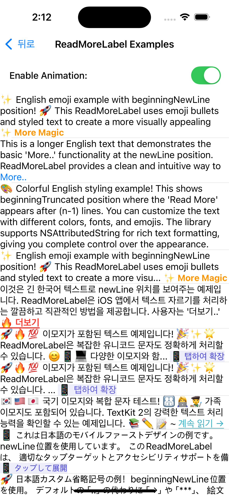

# ReadMoreLabel

[](https://swift.org)
[](https://developer.apple.com/ios/)
[](LICENSE)
[](https://claude.ai)
[](https://github.com/openai/codex)

エレガントなテキストの切り取りと展開機能を提供する、パワフルで柔軟なUILabelサブクラスです。

[한국어](README-ko.md) | [English](README.md) | **日本語**

## 🆕 v0.2.0 新機能

### バグ修正
- **newLine位置でのellipsis問題を修正**: `.newLine`位置を使用する際に省略記号（ellipsis）が表示されない問題を解決
- **テキスト切り取りの改善**: 改行前に省略記号を正しく表示するように切り取りアルゴリズムを改善

### 改善点
- **より良いコード構成**: 保守性向上のための内部構造のリファクタリング
- **カスタマイズの強化**: `.end`と`.newLine`の両方の位置で`ellipsisText`の完全なカスタマイズをサポート

## 🎬 デモ

> **注意**: 最適な体験のために、[デモ動画](screenshots/ReadMoreLabel_Demo.mp4)をダウンロードしてローカルで表示するか、以下のアニメーションスクリーンショットをご確認ください。

[](screenshots/ReadMoreLabel_Demo.mp4)

## 📱 スクリーンショット

### アニメーション例
 

### テーブルビュー例
 

## ✨ 主な機能

- **スマートテキスト切り取り**: 正確なテキストレイアウト計算により、指定した位置に「続きを読む」を表示
- **自然なテキスト連結**: カスタマイズ可能なellipsisテキストでシームレスな視覚的連結（`テキスト.. 続きを読む..`）
- **柔軟な位置制御**: 「続きを読む」が切り取られたコンテンツの末尾または先頭に表示されるよう選択可能
- **文字レベルの精度**: 単語と文字レベルでの切り取り位置の微調整により、スペースの利用を最適化
- **RTL言語サポート**: アラビア語、ヘブライ語など右から左に書く言語の完全サポートとBiDiテキスト処理
- **滑らかなアニメーション**: 内蔵の展開/折りたたみアニメーションとデリゲートコールバック
- **カスタマイズ可能な外観**: 「続きを読む」テキストに対するNSAttributedStringスタイリングをサポート
- **柔軟な設定**: `numberOfLines = 0`で「続きを読む」機能の無効化が可能
- **UILabel互換性**: 最小限のコード変更で既存のUILabelを置き換え可能
- **Interface Builderサポート**: IBDesignableとIBInspectableプロパティをサポート
- **安全なAPI設計**: 継承されたUILabelプロパティの直接変更を防止

## 🚀 インストール

### Swift Package Manager

```swift
dependencies: [
    .package(url: "https://github.com/baccusf/ReadMoreLabel.git", from: "0.2.1")
]
```

### CocoaPods

```ruby
pod 'ReadMoreLabel', '~> 0.2.1'
```

### 手動インストール

1. リポジトリをダウンロード
2. `ReadMoreLabel.swift`ファイルをXcodeプロジェクトにドラッグ

## 📖 使い方

### 基本実装

```swift
import ReadMoreLabel

class ViewController: UIViewController {
    @IBOutlet weak var readMoreLabel: ReadMoreLabel!
    
    override func viewDidLoad() {
        super.viewDidLoad()
        
        // 基本設定
        readMoreLabel.numberOfLinesWhenCollapsed = 3
        readMoreLabel.text = "ここに長いテキストコンテンツを入力..."
        
        // 「続きを読む」テキストのカスタマイズ
        let attributes: [NSAttributedString.Key: Any] = [
            .foregroundColor: UIColor.systemBlue,
            .font: UIFont.systemFont(ofSize: 16, weight: .medium)
        ]
        readMoreLabel.readMoreText = NSAttributedString(string: "続きを読む..", attributes: attributes)
        
        // 展開イベント用のデリゲート設定
        readMoreLabel.delegate = self
    }
}

extension ViewController: ReadMoreLabelDelegate {
    func readMoreLabel(_ label: ReadMoreLabel, didChangeExpandedState isExpanded: Bool) {
        print("ラベルが展開されました: \(isExpanded)")
        
        // オプション: レイアウト変更のアニメーション
        UIView.animate(withDuration: 0.3) {
            self.view.layoutIfNeeded()
        }
    }
}
```

### プログラマティック使用法

```swift
let readMoreLabel = ReadMoreLabel()
readMoreLabel.numberOfLinesWhenCollapsed = 2
readMoreLabel.text = "長いテキストコンテンツ..."
readMoreLabel.translatesAutoresizingMaskIntoConstraints = false

view.addSubview(readMoreLabel)
NSLayoutConstraint.activate([
    readMoreLabel.topAnchor.constraint(equalTo: view.safeAreaLayoutGuide.topAnchor, constant: 20),
    readMoreLabel.leadingAnchor.constraint(equalTo: view.leadingAnchor, constant: 16),
    readMoreLabel.trailingAnchor.constraint(equalTo: view.trailingAnchor, constant: -16)
])
```

### 手動制御

```swift
// プログラマティックな展開/折りたたみ
readMoreLabel.expand()
readMoreLabel.collapse()

// プログラマティックな展開状態設定
readMoreLabel.setExpanded(true)

// 現在の状態を確認
if readMoreLabel.isExpanded {
    print("現在展開中")
}

// テキストが展開可能かどうか確認
if readMoreLabel.isExpandable {
    print("テキストが切り取られており、展開可能")
}
```

### 「続きを読む」機能の無効化

```swift
// 0に設定して切り取りを無効化（通常のUILabelのように動作）
readMoreLabel.numberOfLinesWhenCollapsed = 0
```

## 🎨 カスタマイズ

### プロパティ

| プロパティ | 型 | 説明 | デフォルト |
|-----------|-----|------|----------|
| `numberOfLinesWhenCollapsed` | `Int` | 折りたたみ時に表示する行数（0 = 無制限） | `3` |
| `readMoreText` | `NSAttributedString` | スタイリング可能な「続きを読む」テキスト | `"Read More.."` |
| `ellipsisText` | `NSAttributedString` | 「続きを読む」前のカスタマイズ可能なellipsisテキスト | `".."` |
| `readMorePosition` | `ReadMoreLabel.Position` | 「続きを読む」テキストの位置（`.end`, `.newLine`） | `.end` |
| `isExpanded` | `Bool` | 現在の展開状態（読み取り専用） | `false` |
| `isExpandable` | `Bool` | テキストが展開可能かどうか（読み取り専用） | `計算済み` |
| `delegate` | `ReadMoreLabelDelegate?` | 展開イベント用デリゲート | `nil` |

### デリゲートメソッド

```swift
protocol ReadMoreLabelDelegate: AnyObject {
    func readMoreLabel(_ label: ReadMoreLabel, didChangeExpandedState isExpanded: Bool)
}
```

### スタイリング例

```swift
// 「続きを読む」テキストのカスタマイズ
let readMoreAttributes: [NSAttributedString.Key: Any] = [
    .foregroundColor: UIColor.systemBlue,
    .font: UIFont.systemFont(ofSize: 14, weight: .semibold),
    .underlineStyle: NSUnderlineStyle.single.rawValue
]
readMoreLabel.readMoreText = NSAttributedString(string: "もっと見る →", attributes: readMoreAttributes)

// 様々な言語
readMoreLabel.readMoreText = NSAttributedString(string: "続きを読む..")  // 日本語
readMoreLabel.readMoreText = NSAttributedString(string: "더보기..")     // 韓国語
readMoreLabel.readMoreText = NSAttributedString(string: "Ver más..")   // スペイン語
readMoreLabel.readMoreText = NSAttributedString(string: "اقرأ المزيد")  // アラビア語

// カスタムellipsisと位置制御
readMoreLabel.ellipsisText = NSAttributedString(string: "→")              // ドットの代わりに矢印
readMoreLabel.ellipsisText = NSAttributedString(string: "***")            // アスタリスク
readMoreLabel.ellipsisText = NSAttributedString(string: "✨")             // 絵文字

// 位置制御
readMoreLabel.readMorePosition = .end         // 最後の行: "テキスト.. 続きを読む.." (デフォルト)
readMoreLabel.readMorePosition = .newLine     // 新しい行に「続きを読む..」のみ表示
```

## 🌐 RTL言語サポート

ReadMoreLabelはアラビア語やヘブライ語などの右から左に書く言語を包括的にサポートします：

### RTL設定

```swift
// アラビア語RTL設定
let arabicLabel = ReadMoreLabel()
arabicLabel.semanticContentAttribute = .forceRightToLeft
arabicLabel.textAlignment = .right
arabicLabel.numberOfLines = 3
arabicLabel.text = "هذا نص طويل باللغة العربية يوضح وظائف ReadMoreLabel..."
arabicLabel.readMoreText = NSAttributedString(
    string: "اقرأ المزيد",
    attributes: [.foregroundColor: UIColor.systemBlue]
)

// ヘブライ語RTL設定
let hebrewLabel = ReadMoreLabel()
hebrewLabel.semanticContentAttribute = .forceRightToLeft  
hebrewLabel.textAlignment = .right
hebrewLabel.text = "זה טקסט ארוך בעברית המדגים את הפונקציות של ReadMoreLabel..."
hebrewLabel.readMoreText = NSAttributedString(string: "קרא עוד")
```

### RTL機能

- **自動RTL検出**: `semanticContentAttribute`と`effectiveUserInterfaceLayoutDirection`からRTLコンテキストを自動検出
- **RTL対応テキスト切り取り**: RTLテキストレイアウトに適した正確な切り取り位置の計算
- **BiDiテキスト処理**: 適切なUnicode方向マーカーによる双方向テキストサポート
- **RTLサフィックス順序**: 自然なRTLサフィックス構成（ellipsis + "続きを読む" の正しい順序）
- **タッチエリア保持**: RTLレイアウトでの正確なタッチ検出の維持


## ⚠️ 重要事項

### 保護されたプロパティ

ReadMoreLabelは適切な機能を保証するために特定のUILabelプロパティをオーバーライドします：

- **`numberOfLines`**: 代わりに`numberOfLinesWhenCollapsed`を使用
- **`lineBreakMode`**: `.byWordWrapping`に固定

これらのプロパティを直接設定しようとするとデバッグ警告が表示され、無視されます。

### ネーミング競合

他のライブラリと競合が発生する場合、Swiftのモジュールネームスペースを使用してください：

```swift
import ReadMoreLabel
let label = ReadMoreLabel.ReadMoreLabel()  // 完全モジュール名

// またはtypealiasを作成
typealias MyReadMoreLabel = ReadMoreLabel.ReadMoreLabel
let label = MyReadMoreLabel()
```

### ベストプラクティス

1. **Auto Layout**: 適切なテキスト測定のため常にAuto Layout制約を使用
2. **パフォーマンス**: 大量のテキストの場合、最初に`numberOfLines = 0`に設定し、必要時に切り取りを有効化することを検討
3. **アクセシビリティ**: コンポーネントは自動的にVoiceOverとDynamic Typeをサポート
4. **スレッドセーフティ**: 常にメインスレッドでプロパティを更新
5. **多言語サポート**: TextKit2を使用して様々な言語でのグリフ計算の問題を解決し、正確なテキスト測定を提供

## 🔧 高度な使用法

### カスタムアニメーション

```swift
func readMoreLabel(_ label: ReadMoreLabel, didChangeExpandedState isExpanded: Bool) {
    // カスタムスプリングアニメーション
    UIView.animate(
        withDuration: 0.6,
        delay: 0,
        usingSpringWithDamping: 0.8,
        initialSpringVelocity: 0.2,
        options: .curveEaseInOut
    ) {
        self.view.layoutIfNeeded()
    }
}
```

### UITableView/UICollectionViewとの統合

```swift
// テーブルビューセルで
class ExampleTableViewCell: UITableViewCell {
    private let readMoreLabel: ReadMoreLabel = {
        let label = ReadMoreLabel()
        label.numberOfLines = 3
        label.font = UIFont.systemFont(ofSize: 16)
        label.textColor = .label
        label.translatesAutoresizingMaskIntoConstraints = false
        return label
    }()
    
    func configure(with text: String, isExpanded: Bool, delegate: ReadMoreLabelDelegate?) {
        // デリゲートを最初に設定
        readMoreLabel.delegate = delegate
        
        // テキスト内容を設定
        readMoreLabel.text = text
        
        // 展開状態設定
        readMoreLabel.setExpanded(isExpanded)
    }
    
}

// ビューコントローラーで
class ViewController: UIViewController {
    @IBOutlet weak var tableView: UITableView!
    var expandedStates: [Bool] = []  // 各セルの展開状態を追跡
    
    func tableView(_ tableView: UITableView, cellForRowAt indexPath: IndexPath) -> UITableViewCell {
        let cell = tableView.dequeueReusableCell(withIdentifier: "ExampleCell", for: indexPath) as! ExampleTableViewCell
        let isExpanded = expandedStates[indexPath.row]
        cell.configure(with: sampleTexts[indexPath.row], isExpanded: isExpanded, delegate: self)
        return cell
    }
}

extension ViewController: ReadMoreLabelDelegate {
    func readMoreLabel(_ label: ReadMoreLabel, didChangeExpandedState isExpanded: Bool) {
        // labelの中心点をtableView座標系に変換
        let labelCenterInTableView = label.convert(label.center, to: tableView)
        
        // その位置のindexPathを見つける
        guard let indexPath = tableView.indexPathForRow(at: labelCenterInTableView) else {
            return
        }
        
        expandedStates[indexPath.row] = isExpanded
        
        // レイアウト変更アニメーション
        UIView.animate(withDuration: 0.3) {
            self.tableView.beginUpdates()
            self.tableView.endUpdates()
        }
    }
}
```

## 🛠 要件

- iOS 16.0+
- Swift 5.0+
- Xcode 16.0+

## 💡 Swift バージョン互換性

ReadMoreLabelはSwift 5.0+で開発されています。Swiftバージョン互換性に関する注意事項：

### 上位互換性（Forward Compatibility）
- **Swift 5.0で開発されたライブラリは上位バージョン（6.0、7.0など）でも正常動作**します
- ユーザーがSwift 6.2を使用していてもSwift 5.0ライブラリを問題なく使用可能
- Swiftは上位互換性を保証するよう設計されています

### ABI安定性（ABI Stability）
- **Swift 5.1からABIが安定化**され、異なるSwiftバージョンでコンパイルされたバイナリが互換
- ランタイム互換性を保証
- App Store配布時も問題なし

### 推奨事項
- ライブラリ最小要件バージョン：**Swift 5.0**
- ユーザーはSwift 5.0以上のどのバージョンでも使用可能
- 最新機能が必要な場合のみ上位バージョンを要求

## 📄 ライセンス

ReadMoreLabelはMITライセンスの下で提供されています。詳細は[LICENSE](LICENSE)ファイルを参照してください。

## 🤝 コントリビューション

ReadMoreLabelは**Git Flow**ワークフローに従います。以下のガイドラインを遵守してください：

1. リポジトリをフォーク
2. `develop`から機能ブランチを作成（`git checkout develop && git checkout -b feature/amazing-feature`）
3. コミットメッセージ形式を遵守：`<type>: <description>`
   - タイプ：`feat`, `fix`, `docs`, `style`, `refactor`, `test`, `chore`
4. Swift Style Guide原則を遵守してください
5. 新機能にテストを追加してください
6. 適切な形式で変更をコミット：
   ```
   feat: 素晴らしい新機能を追加
   
   変更の詳細説明
   
   🎯 Generated with Claude Code
   Co-Authored-By: Claude <noreply@anthropic.com>
   ```
7. ブランチにプッシュ（`git push origin feature/amazing-feature`）
8. `develop`ブランチをターゲットにPull Requestを開く
9. PRテンプレートを完全に記入してください


## 📞 サポート

- バグ報告や機能リクエストはissueを作成してください
- 新しいissueを作成する前に既存のissueを確認してください
- バグ報告時は詳細な再現手順を提供してください

## 🙏 謝辞

**ClaudeとのAIペアプログラミング**を使用してiOS開発コミュニティのために❤️で作成されました。

---

**Swift & AIで作成** 🚀