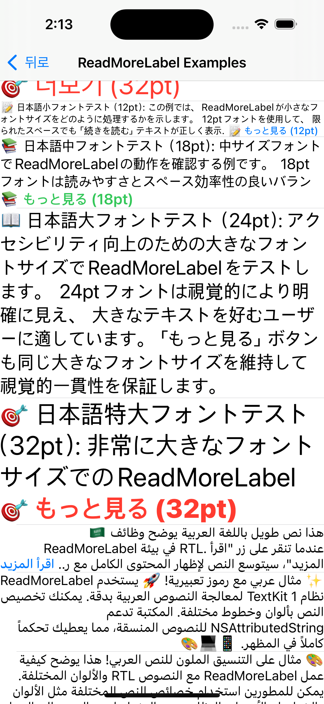

# ReadMoreLabel

[](https://swift.org)
[](https://developer.apple.com/ios/)
[](LICENSE)
[](https://claude.ai)
[](https://github.com/openai/codex)

A powerful and flexible UILabel subclass that provides "Read More" functionality with elegant text truncation and expansion capabilities.

[한국어](README-ko.md) | [日本語](README-ja.md) | **English**

## 🆕 What's New in v0.2.0

### Bug Fixes
- **Fixed ellipsis issue in newLine position**: Resolved an issue where ellipsis text was not displayed when using `.newLine` position
- **Improved text truncation**: Enhanced the truncation algorithm to properly show ellipsis before line breaks

### Improvements
- **Better code organization**: Refactored internal structure for improved maintainability
- **Enhanced customization**: Full support for `ellipsisText` customization in both `.end` and `.newLine` positions

## 🎬 Demo

> **Note**: For the best experience, please download and view the [Demo Video](screenshots/ReadMoreLabel_Demo.mp4) locally or check the animated screenshots below.

[](screenshots/ReadMoreLabel_Demo.mp4)

## 📱 Screenshots

### Animation Examples
 

### Table View Examples  
 

## ✨ Features

- **Smart Text Truncation**: Precisely calculates text layout to show "Read More" at the specified position
- **Natural Text Flow**: Customizable ellipsis text before "Read More" for seamless visual connection (`text.. Read More..`)
- **Flexible Positioning**: Choose whether "Read More" appears at the end or beginning of truncated content
- **Character-Level Precision**: Fine-tunes truncation at both word and character levels for optimal space utilization
- **RTL Language Support**: Full support for Right-to-Left languages (Arabic, Hebrew) with proper BiDi text handling
- **Smooth Animations**: Built-in expand/collapse animations with delegate callbacks
- **Customizable Appearance**: Support for NSAttributedString styling on "Read More" text
- **Flexible Configuration**: Disable "Read More" functionality by setting `numberOfLines = 0`
- **UILabel Compatibility**: Drop-in replacement with minimal code changes
- **Interface Builder Support**: IBDesignable with IBInspectable properties
- **Safe API Design**: Prevents direct modification of inherited UILabel properties

## 🚀 Installation

### Swift Package Manager

```swift
dependencies: [
    .package(url: "https://github.com/baccusf/ReadMoreLabel.git", from: "0.2.0")
]
```

### CocoaPods

```ruby
pod 'ReadMoreLabel', '~> 0.2.0'
```

### Manual Installation

1. Download the repository
2. Drag `ReadMoreLabel.swift` into your Xcode project

## 📖 Usage

### Basic Implementation

```swift
import ReadMoreLabel

class ViewController: UIViewController {
    @IBOutlet weak var readMoreLabel: ReadMoreLabel!
    
    override func viewDidLoad() {
        super.viewDidLoad()
        
        // Basic configuration
        readMoreLabel.numberOfLines = 3
        readMoreLabel.text = "Your long text content here..."
        
        // Custom "Read More" text with styling
        let attributes: [NSAttributedString.Key: Any] = [
            .foregroundColor: UIColor.systemBlue,
            .font: UIFont.systemFont(ofSize: 16, weight: .medium)
        ]
        readMoreLabel.readMoreText = NSAttributedString(string: "Read More..", attributes: attributes)
        
        // Customize ellipsis text and position
        readMoreLabel.ellipsisText = NSAttributedString(string: "→")  // Custom ellipsis
        readMoreLabel.readMorePosition = .end  // Position at end (default)
        
        // Set delegate for expansion events
        readMoreLabel.delegate = self
    }
}

extension ViewController: ReadMoreLabelDelegate {
    func readMoreLabel(_ label: ReadMoreLabel, didChangeExpandedState isExpanded: Bool) {
        print("Label expanded: \(isExpanded)")
        
        // Optional: Animate layout changes
        UIView.animate(withDuration: 0.3) {
            self.view.layoutIfNeeded()
        }
    }
}
```

### Programmatic Usage

```swift
let readMoreLabel = ReadMoreLabel()
readMoreLabel.numberOfLines = 2
readMoreLabel.text = "Long text content..."
readMoreLabel.translatesAutoresizingMaskIntoConstraints = false

view.addSubview(readMoreLabel)
NSLayoutConstraint.activate([
    readMoreLabel.topAnchor.constraint(equalTo: view.safeAreaLayoutGuide.topAnchor, constant: 20),
    readMoreLabel.leadingAnchor.constraint(equalTo: view.leadingAnchor, constant: 16),
    readMoreLabel.trailingAnchor.constraint(equalTo: view.trailingAnchor, constant: -16)
])
```

### Manual Control

```swift
// Programmatically expand/collapse
readMoreLabel.expand()
readMoreLabel.collapse()

// Set expansion state programmatically
readMoreLabel.setExpanded(true)

// Check current state
if readMoreLabel.isExpanded {
    print("Currently expanded")
}

// Check if text can be expanded
if readMoreLabel.isExpandable {
    print("Text is truncated and can be expanded")
}
```

### Disable "Read More" Functionality

```swift
// Set to 0 to disable truncation (behaves like normal UILabel)
readMoreLabel.numberOfLines = 0
```

## 🎨 Customization

### Properties

| Property | Type | Description | Default |
|----------|------|-------------|---------|
| `numberOfLines` | `Int` | Number of lines to show when collapsed (0 = unlimited) | `3` |
| `readMoreText` | `NSAttributedString` | Customizable "Read More" text with styling | `"Read More.."` |
| `ellipsisText` | `NSAttributedString` | Customizable ellipsis text before "Read More" | `".."` |
| `readMorePosition` | `ReadMoreLabel.Position` | Position of "Read More" text (`.end`, `.newLine`) | `.end` |
| `isExpanded` | `Bool` | Current expansion state (read-only) | `false` |
| `isExpandable` | `Bool` | Whether text can be expanded (read-only) | `computed` |
| `delegate` | `ReadMoreLabelDelegate?` | Delegate for expansion events | `nil` |

### Delegate Methods

```swift
protocol ReadMoreLabelDelegate: AnyObject {
    func readMoreLabel(_ label: ReadMoreLabel, didChangeExpandedState isExpanded: Bool)
}
```

### Styling Examples

```swift
// Custom styling for "Read More" text
let readMoreAttributes: [NSAttributedString.Key: Any] = [
    .foregroundColor: UIColor.systemBlue,
    .font: UIFont.systemFont(ofSize: 14, weight: .semibold),
    .underlineStyle: NSUnderlineStyle.single.rawValue
]
readMoreLabel.readMoreText = NSAttributedString(string: "Show More →", attributes: readMoreAttributes)

// Different languages
readMoreLabel.readMoreText = NSAttributedString(string: "続きを読む..")  // Japanese
readMoreLabel.readMoreText = NSAttributedString(string: "더보기..")     // Korean
readMoreLabel.readMoreText = NSAttributedString(string: "Ver más..")   // Spanish
readMoreLabel.readMoreText = NSAttributedString(string: "اقرأ المزيد")  // Arabic

// Custom ellipsis and positioning
readMoreLabel.ellipsisText = NSAttributedString(string: "→")              // Arrow instead of dots
readMoreLabel.ellipsisText = NSAttributedString(string: "***")            // Asterisks
readMoreLabel.ellipsisText = NSAttributedString(string: "✨")             // Emoji

// Position control  
readMoreLabel.readMorePosition = .end         // Last line: "text.. Read More.." (default)
readMoreLabel.readMorePosition = .newLine     // New line after truncated text: "Read More.." only
```

## 🌐 RTL Language Support

ReadMoreLabel provides comprehensive support for Right-to-Left languages such as Arabic and Hebrew:

### RTL Configuration

```swift
// Arabic RTL setup
let arabicLabel = ReadMoreLabel()
arabicLabel.semanticContentAttribute = .forceRightToLeft
arabicLabel.textAlignment = .right
arabicLabel.numberOfLines = 3
arabicLabel.text = "هذا نص طويل باللغة العربية يوضح وظائف ReadMoreLabel..."
arabicLabel.readMoreText = NSAttributedString(
    string: "اقرأ المزيد",
    attributes: [.foregroundColor: UIColor.systemBlue]
)

// Hebrew RTL setup
let hebrewLabel = ReadMoreLabel()
hebrewLabel.semanticContentAttribute = .forceRightToLeft  
hebrewLabel.textAlignment = .right
hebrewLabel.text = "זה טקסט ארוך בעברית המדגים את הפונקציות של ReadMoreLabel..."
hebrewLabel.readMoreText = NSAttributedString(string: "קרא עוד")
```

### RTL Features

- **Automatic RTL Detection**: Detects RTL context from `semanticContentAttribute` and `effectiveUserInterfaceLayoutDirection`
- **RTL-Aware Text Truncation**: Properly calculates truncation positions for RTL text layout
- **BiDi Text Handling**: Supports bidirectional text with proper Unicode directional markers
- **RTL Suffix Ordering**: Natural RTL suffix composition (ellipsis + "Read More" in correct order)
- **Touch Area Preservation**: Maintains accurate touch detection in RTL layouts


## ⚠️ Important Notes


### Best Practices

1. **Auto Layout**: Always use Auto Layout constraints for proper text measurement
2. **Performance**: For large amounts of text, consider setting `numberOfLines = 0` initially and enabling truncation when needed
3. **Accessibility**: The component automatically supports VoiceOver and Dynamic Type
4. **Thread Safety**: Always update properties on the main thread
5. **Multilingual Support**: Uses TextKit2 to resolve glyph calculation issues in various languages and provide accurate text measurement

## 🔧 Advanced Usage

### Custom Animation

```swift
func readMoreLabel(_ label: ReadMoreLabel, didChangeExpandedState isExpanded: Bool) {
    // Custom spring animation
    UIView.animate(
        withDuration: 0.6,
        delay: 0,
        usingSpringWithDamping: 0.8,
        initialSpringVelocity: 0.2,
        options: .curveEaseInOut
    ) {
        self.view.layoutIfNeeded()
    }
}
```

### Integration with UITableView/UICollectionView

```swift
// In your table view cell
class ExampleTableViewCell: UITableViewCell {
    private let readMoreLabel: ReadMoreLabel = {
        let label = ReadMoreLabel()
        label.numberOfLines = 3
        label.font = UIFont.systemFont(ofSize: 16)
        label.textColor = .label
        label.translatesAutoresizingMaskIntoConstraints = false
        return label
    }()
    
    func configure(with text: String, isExpanded: Bool, delegate: ReadMoreLabelDelegate?) {
        // Set delegate first
        readMoreLabel.delegate = delegate
        
        // Set text content
        readMoreLabel.text = text
        
        // Set expanded state
        readMoreLabel.setExpanded(isExpanded)
    }
    
}

// In your view controller
class ViewController: UIViewController {
    @IBOutlet weak var tableView: UITableView!
    var expandedStates: [Bool] = []  // Track expanded states for each cell
    
    func tableView(_ tableView: UITableView, cellForRowAt indexPath: IndexPath) -> UITableViewCell {
        let cell = tableView.dequeueReusableCell(withIdentifier: "ExampleCell", for: indexPath) as! ExampleTableViewCell
        let isExpanded = expandedStates[indexPath.row]
        cell.configure(with: sampleTexts[indexPath.row], isExpanded: isExpanded, delegate: self)
        return cell
    }
}

extension ViewController: ReadMoreLabelDelegate {
    func readMoreLabel(_ label: ReadMoreLabel, didChangeExpandedState isExpanded: Bool) {
        // Convert label's center point to table view coordinate system
        let labelCenterInTableView = label.convert(label.center, to: tableView)
        
        // Find the indexPath for that position
        guard let indexPath = tableView.indexPathForRow(at: labelCenterInTableView) else {
            return
        }
        
        expandedStates[indexPath.row] = isExpanded
        
        // Animate layout changes
        UIView.animate(withDuration: 0.3) {
            self.tableView.beginUpdates()
            self.tableView.endUpdates()
        }
    }
}
```

## 🛠 Requirements

- iOS 16.0+
- Swift 5.0+
- Xcode 13.0+

## 📄 License

ReadMoreLabel is available under the MIT license. See the [LICENSE](LICENSE) file for more info.

## 🤝 Contributing

1. Fork the repository
2. Create your feature branch (`git checkout -b feature/amazing-feature`)
3. Commit your changes (`git commit -m 'Add some amazing feature'`)
4. Push to the branch (`git push origin feature/amazing-feature`)
5. Open a Pull Request

## 📞 Support

- Create an issue for bug reports or feature requests
- Check existing issues before creating a new one
- Provide detailed reproduction steps for bug reports

## 🙏 Acknowledgments

Built with ❤️ for the iOS development community using **AI-powered pair programming** with Claude.

---

**Made with Swift & AI** 🚀